# NotifyKer

*Notifier and manager bot for ML libraries: Keras and Chainer* 

### Features:

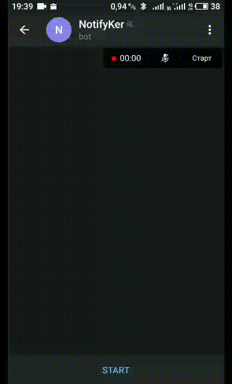

- Get status of your training: epoch, metrics
- Temporarily suspend training and then continue (for example, to free up the C(G)PU for another task (not the memory))
- Interrupt training immediately
- Get updates per epoch/batch with metrics
- Set verbose level:
  - 0 - only completion message;
  - 1 - execution status per epoch
  - 2 - execution status per epoch with on-line metrics (like Keras default output) 
- Easy to build your own notifier and callback

------

### How to use

Set TOKEN and PROXY while creating the instance of NotifierTelegramMenu or NotifierTelegram

#### Chainer

```python
from notifyker import NotifierTelegramMenu
from notifyker.chainer import ExtensionNotifierReport

TOKEN = 'xxxx:yyy'
PROXY = {
    'proxy_url': 'socks5h://ip:port', 
    'urllib3_proxy_kwargs': {'username': 'username', 'password': 'password'}}

# use NotifierTelegram in order to work without keyboard menu
nfk = NotifierTelegramMenu(TOKEN=TOKEN, PROXY=PROXY)
chainer_not = ExtensionNotifierReport(notifier=nfk)

...
trainer.extend(chainer_not)
trainer.run()
```


#### Keras

```python
from notifyker import NotifierTelegramMenu
from notifyker.keras import CallbackSimple

TOKEN = 'xxxx:yyy'
PROXY = {
    'proxy_url': 'socks5h://ip:port', 
    'urllib3_proxy_kwargs': {'username': 'username', 'password': 'password'}}

# use NotifierTelegram in order to work without keyboard menu
nfk = NotifierTelegramMenu(TOKEN=TOKEN, PROXY=PROXY)
callback = CallbackSimple(notifier=nfk)

model.fit(...
	callbacks=[callback])
```

Set PROXY = None if not required

### **Start**

Enter */start* command to your telegram bot. Now it started and you receive update messages.

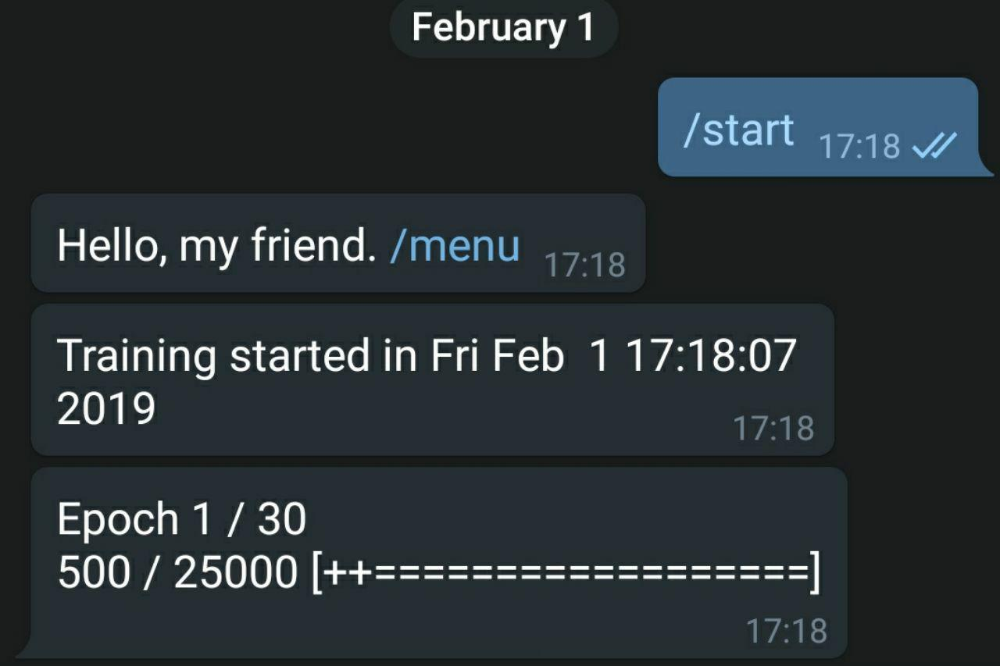

### Menu

Enter */menu* to open keyboard menu with following options:

- Status - get the status of the last completed epoch

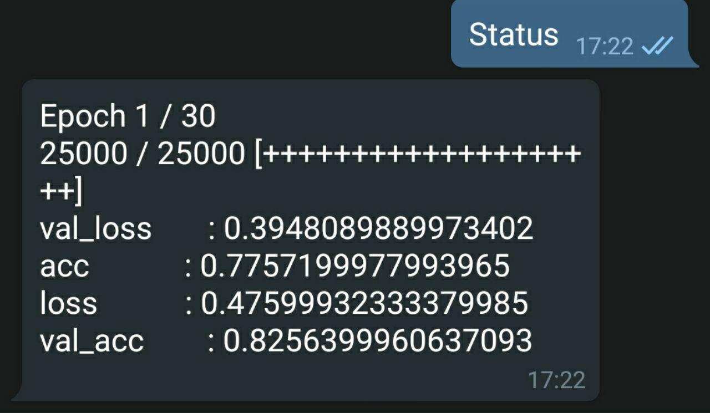

------


- Verbose - change verbose level or leave unchanged

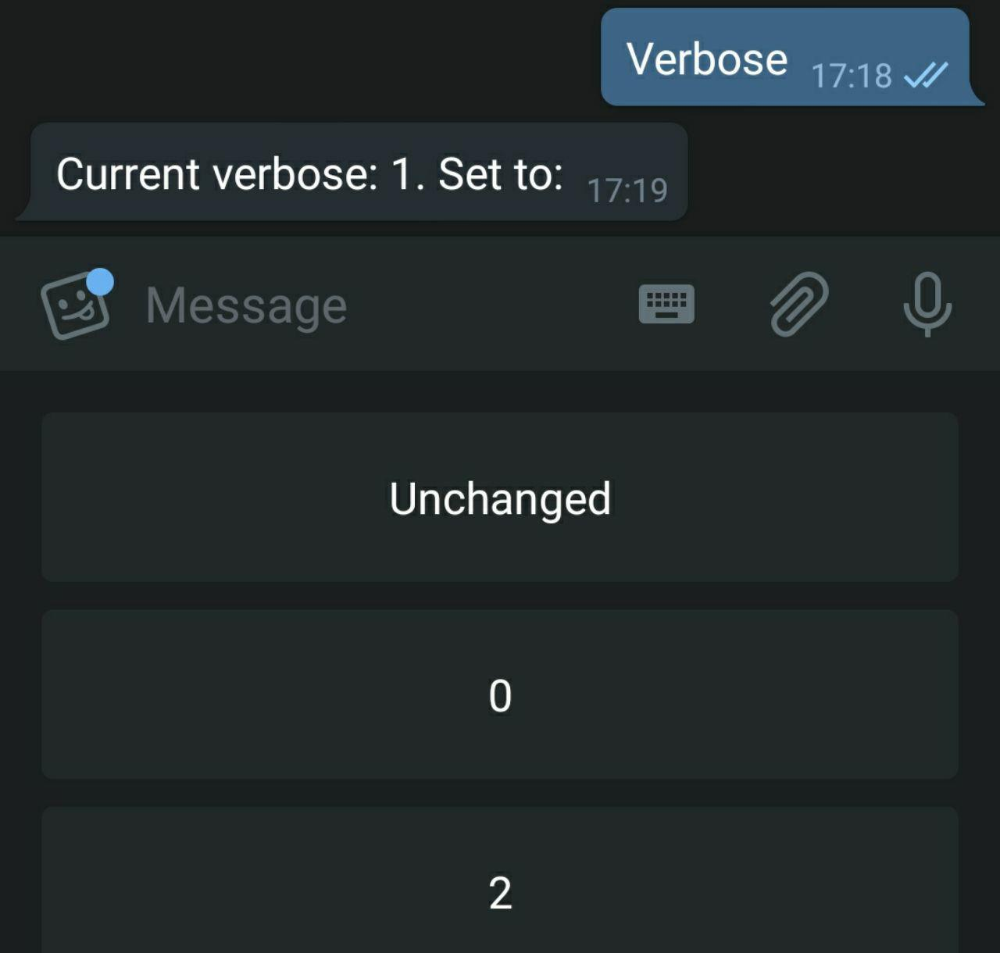

Level 0:

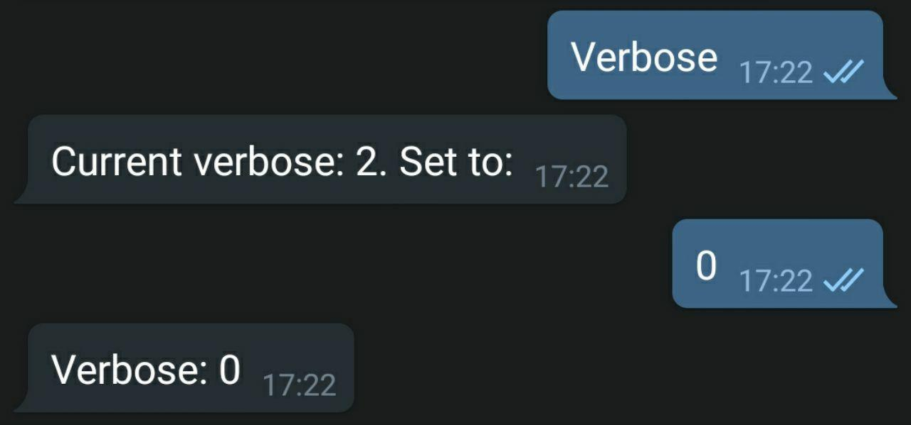

Level 2:

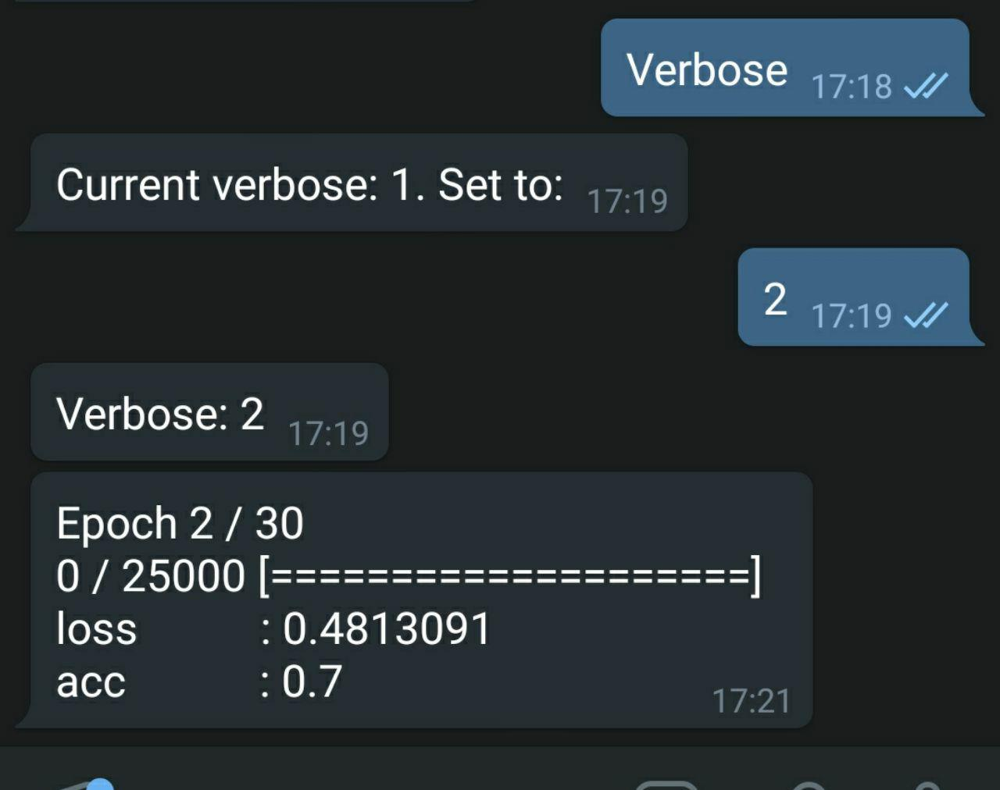

------


- Pause - suspend training process (with option block on_batch_end callback method)

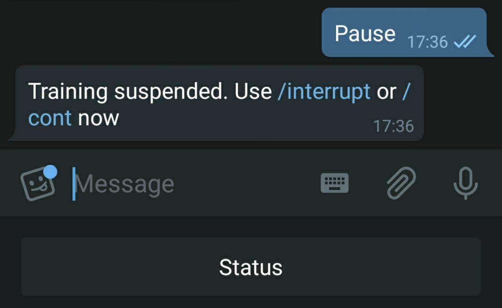

------


- Continue - continue suspended training process

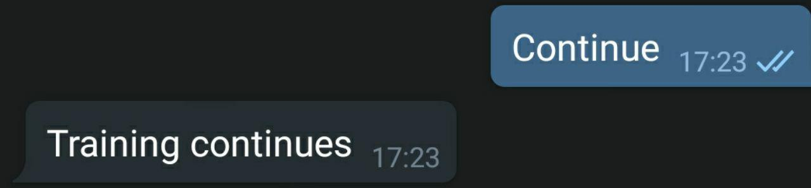

------


- Interrupt - stop training and stop bot updates

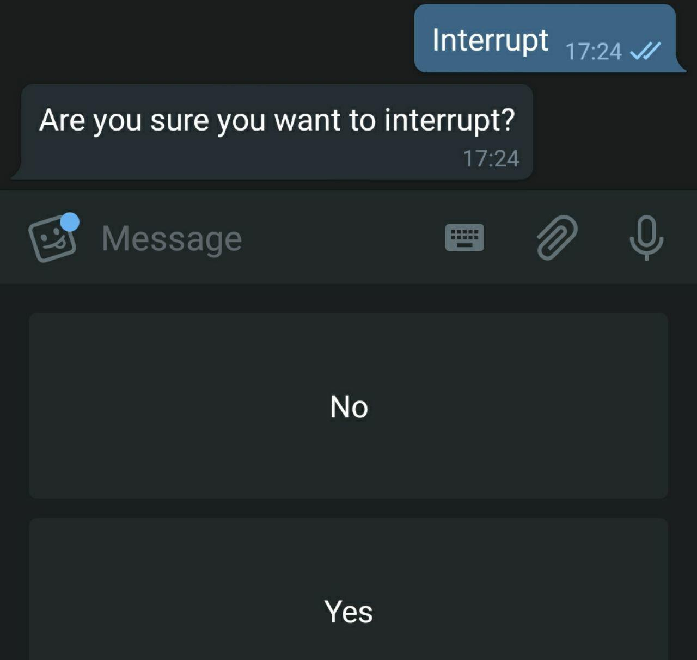

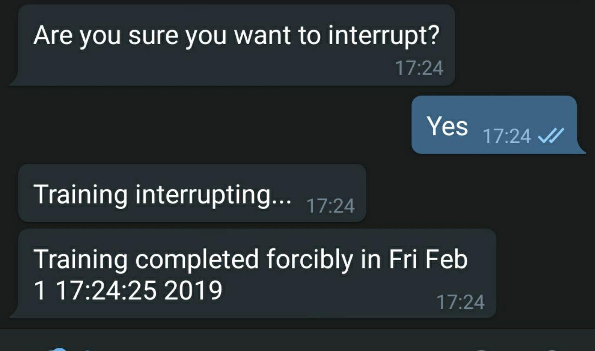

------


### Commands

Also, you can use these commands directly by typing:

- /status
- /verbose - only get the current level of verbose (TODO: opportunity to change)
- /pause
- /continue
- /interrupt
- /help - get the description of commands|options


### Your own notifier

import base class (NotifierBase or NotifierTelegram)

```python
from notifyker import NotifierTelegram
```

Then create your own class with inheritance and implement/reimplement methods. Note: if you add some new command - add it to handler

```python
from telegram.ext import CommandHandler  # if required


class MyOwnNotifyker(NotifierTelegram):
	def my_own_hello(self, bot, update):
		"""
		Send hello in reply
		"""
		self.updater.reply_text('Hello!')
        
    def handlers(self):
        super().handlers()
        self.updater.dispatcher.add_handler(CommandHandler('hello', self.my_own_hello))
```

That's it!

### Your own callback

Also, you can use your own callback in the same way. Let's say you want only to know when the training ends.

```python
import time

from notifyker import CallbackBase


class MyOwnCallback(CallbackBase):
    def on_training_end(self):
        end_time = time.ctime(int(time.time()))

        self.notifier.message('Training completed {} in {}'.format(tag, end_time))

```

### Register your own telegram bot

In order to create your own telegram bot - talk to t.me/botfather - this is official bot to... create bots.

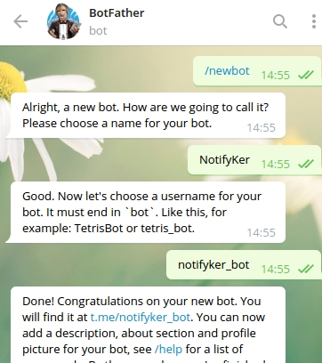

Also, you'll get a TOKEN of your bot, that will be used in the Notifier latter. Click on the name of your bot and the chat will open with your bot. 

Also, BotFather allows to manage bot profile image, description, privacy options, etc.

Official introduction is here: https://core.telegram.org/bots

### Notifier for TF

It is possible to use this for tensorflow, but you should add necessary functions in your tf code. Just create:

```python
nfk = NotifierTelegramMenu(TOKEN=TOKEN, PROXY=PROXY)
```

For example, in order to implement pause, after your epoch add:

```python
if 'p' in nfk.flags_batch:
    self.notifier.flags_batch.remove('p')
    while 'c' not in nfk.flags_batch and 's' not in nfk.flags_batch:
        time.sleep(10)
```

You can look at callbackNK/callback_simple.py to find more information about implementation.